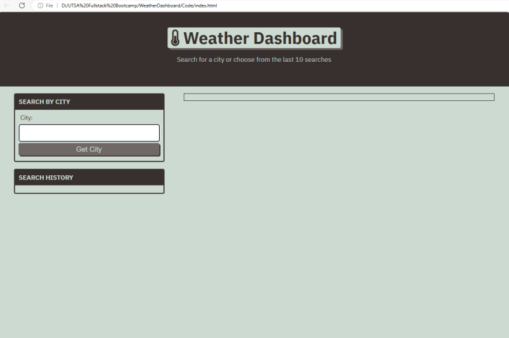
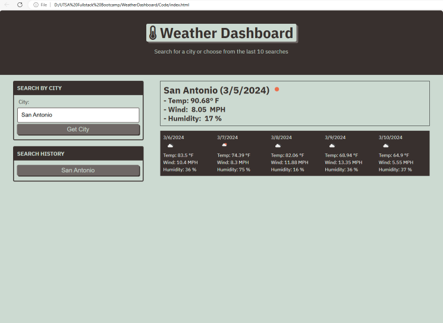
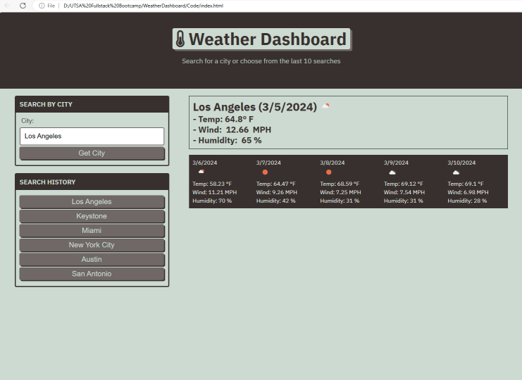
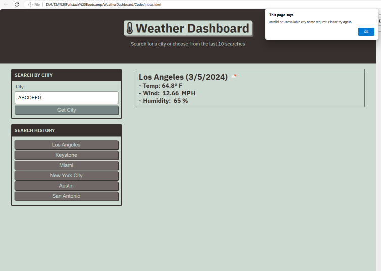

# Weather Dashboard / Project Module 6

This project uses OpenWeather API in order to access weather information
This project is based on using Javascript and other front end dev tools to create a web app to help a user to search for current as well as 5 day forecasts for a city of their choice

## Table of Contents

- [About](#about)
- [Getting Started](#getting_started)
- [Installing](#installing)
- [Usage](#usage)
- [Screenshots](#screenshots)
- [Includes](#includes)
- [Contributing](#contributing)

## About

 - This website allows the user to search current and forecasted weather conditions for a city of their choice
 - This website only allows for one day (current day) and five day forecasts
 - A user search history is stored via local storage

## Getting Started

When the page is loaded if there is no search history by the user the page starts blank.
If the user has searched before, there is a search history list that shows the last 10 searches and a simple click on that past search will bring up current and forecasted information for that city 

## Installing

No installation necessary.
New users will not have a search history but will start building one up to ten recent for future visits to the site

## Usage

This website can be used to get an idea of current weather conditions as well as forecasted weather conditions so that the user has an idea of what kind of weather to expect of they are planning an outdoor event or traveling
This website stores the last 10 searches that the user has submitted

## Screenshots

## Includes

 - This code uses jQuery and the following source (src) "https://code.jquery.com/jquery-3.5.1.min.js"
 - This code uses Bootstrap "https://cdn.jsdelivr.net/npm/bootstrap@5.1.3/dist/css/bootstrap.min.css"
 - This code uses ajax "https://cdnjs.cloudflare.com/ajax/libs/jquery/3.2.1/jquery.min.js"
 - This code uses OpenWeather API "https://openweathermap.org/"
 - This code uses dayjs "https://cdn.jsdelivr.net/npm/dayjs@1.11.3/dayjs.min.js"

Github Repository: https://github.com/DougyShy/WeatherDashboard
Githup Pages Address: https://dougyshy.github.io/WorkScheduler/

## Contributing

Clinton Scheible
- UTSA Bootcamp
- Weather Dashboard Challenge / Module 6

